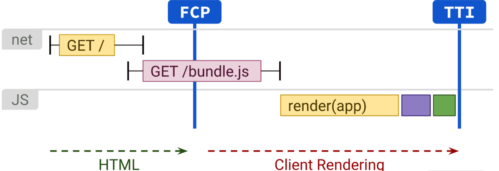

# 前端历史发展概述

## 概述前端现状，以及相关的工作职位

### 什么是web前端，什么是前端开发工程师？

__Web前端是运行在现代浏览器环境下的编程交互技术，用于呈现UI界面，以及与用户交互的’前端’工作。前端技术以html形成文档主体，css控制界面样式，并由整个JavaScript语言生态实现从打包到交互的整体赋能。__

所以web前端首先是运行在浏览器下的编程技术，如果再扩展到手机端和电脑桌面端，就构成了整个“大前端”的概念

前端工程师：是使用前端技术，解决前端问题的工程技术人员

### 前端工作里是否含有UI界面

现代编程项目开发中，界面是最终和用户交互的载体，是需要反复讨论，不断修改的
所以一般会有 产品经理和市场侧共同讨论，做出界面原型
原型产生后，会有专业的UI人员，将原型绘制成UI图片，会详细到字体，图标，间距，排版等细节
但UI图片并不能作为可交互的界面，这时前端工程师会和UI沟通，使用代码将UI图实现为可交互的界面

__所以前端工程师是不含有UI工作的__

### 当今互联网开发中有哪些职位，与前端有什么交集
* 前端工程师：负责前端的研发主力

* 后端工程师：用接口的形式为前端提供各种后端服务

* 产品经理：负责产品的设计，链接市场侧和研发侧

* 项目经理：管理研发版本排期，对细分化的项目负责
* 技术负责人：整合前后端项目，管理研发团队
* 测试工程师：测试产品功能，确保交互产品的质量
* UI工程师：转化产品设计为直观的图像，为前端提供辅助支持

* 运维工程师：发布研发交互的产品，日常维护产品运行

* 市场运营：收集用户反馈，推销产品，整理市场需求


整个线路

老板--投资人--市场--生态--产品设计--架构设计--UI设计--项目经理--产品开发--前后端开发--系统测试--运维上线--集成维护--迭代升级

it工作者各司其职，研发序列可以深入钻研技术向更高的技术职位发展，也可以研究产品，转到产品序列
但任何一种转职都是困难的，所有的it工作者都是终身学习者，要在不同时间点对深入专研还是广博了解做出选择。
产品类工作稀少，一般一个产品搭配6到10人的研发团队，一名测试同时能处理3到4名研发的工作测试，
产品类工作更加需要工作经验作为敲门砖， 项目管理类工作则常常由技术或产品大佬兼任。

### 前端工程师的工资水平 和 人才缺口
首先在2009年后 前端迎来的大发展，同时伴随移动物联网浪潮，前端跨平台的特性成为大多数公司统一的需求
前端职位迎来了井喷式的增加
又由于前端技术工程化发展的时间较短，所以发展内的公司前端职位的空缺都比较大

## 研究所课程介绍

[前端演进概论](./font.md)

[react框架基础](./guide01.md)

[react框架生态](./guide02.md)

[构建可持续，可扩展的react应用](./guide03.md)

[react常见场景最佳实践](./guide04.md)

[Vue 框架技术理论](./guide005.md)

[Vue 生态库](./guide06.md)

[Vue最佳实践](./guide07.md)

[打包工具](./guide08.md)

[公司实际项目综合实践](./guide09.md)

## Js 语言发展

最早的前端技术就是HTML，浏览器是作为一个静态文档展示器被设计出来的
然后js为了能让HTML文档动起来，作为一种动态脚本语言在一周内被开发了出来


由于js开发时间很短，且糅合了太多各种其它语言的特性


然后node 与现代浏览器慢慢实现了kevin danger提出的模块化规范


渐渐形成ECMASCRIPT 标准委员会，每年讨论新的语法提案，持续提高js的能力和易用性


ECMAScript 6.0（以下简称 ES6）是 JavaScript 语言的下一代标准，已经在 2015 年 6 月正式发布了。它的目标，是使得 JavaScript 语言可以用来编写复杂的大型应用程序，成为企业级开发语言。

ES6 是JS的超集，而TypeScript等 又是 ES6 的超集，类似与 C语言和C++的关系；

由于ES6提案更新的很快，语法实现都比较新，但市场上主流的浏览器内核却属于不同的公司，浏览器更新的速度赶不上JS语言更新的速度
所以诞生Babel 库来将Es的新语法编译成老版本浏览器也支持的ES5；

同时诞生了垫片库 如core-js ，将ES6及后面的新语法用老板语法实现一遍
从而使新语言实现的项目能够正常在市场上的绝大多数浏览器上运行

推荐电子书籍：

[ECMAScript 6 入门--阮一峰](https://es6.ruanyifeng.com/#README)

[查询新语法的浏览器支持情况 Can I Use](https://caniuse.com/ciu/index)


## 前端发展概述 和 未来模式展望

然后介绍前端发展， html的发展，css的发展， js到es的发展；

讲诉架构发展 csr--ssr--nsr--esr
打包工具发展 rollback， gulp ，webpack， vite
js后端从无到有 node，以及deno

讲诉框架发展 jq， angular， vue， react

总结前端， 诞生大量新的技术类工作
* 前端开发工程师
* 移动端开发
* 大前端工程师
* js开发工程师
* node开发工程师
* 前端图形图像方向
* 前端视频流媒体方向
* 前端游戏

入门平滑，后续陡峭，存在多方向发展的道路，但同样需要付出加倍的努力

## 如何学习前端工程化基建和架构设计？

我们先从前端的技术发展轨迹说起，如下图所示：


整体看来，架构层面 MVC 风格向 MVVM 风格的演进，不仅简化了数据与视图的依赖，还解决了数据频繁更新的问题。再加上虚拟 DOM 理念，为开发者屏蔽了 DOM 操作，业界框架方案逐渐稳定，这种低耦合模式也代表了现代化的设计理念。

这个时期，前后端分离技术发展到了顶峰，前端框架也互相学习借鉴，直到如今的Vue/React/Angular 三足鼎立的局面。

这个时代的稳定性一直持续到 Node.js 的崛起，随着 Node.js 的出现，稳固的技术体系瞬间被打破。通过 Node.js，除了前端工具链、工程化得以发展，前端也实现 BFF（Backend For Frontend）层，这样的架构设计好处显而易见：

前端工程师可以自行编写后端服务，实现数据的适配，应用场景包括接口的整合编排、字段裁剪；

前端工程师可以实现SSR（服务端渲染直出）技术，达到提升首屏性能以及 SEO 友好的目的；

前端工程师可以实现各种后端领域服务。

为了“紧跟技术潮流”的发展，Vue 和 React 等当红框架依靠虚拟 DOM 技术，推出同构方案。SSR 架构模式横空出世，成了前端技术演进的新方向。

但是 Node.js 技术不是银弹，SSR 架构也不是毫无成本。前端工程师落地 Node.js 技术，就要关心服务器的运维、部署、发布、监控。有没有一种“just work”的技术，使得我们能够更轻松地专注前端业务代码的开发，直接上手 Node.js 呢？

为了解决上述问题，Serverless 理念应运而生。简单来说，我们可以将服务器的运维功能都交给 Serverless 平台进行管理，研发人员只需要专注于实现云函数即可完成功能开发。

你看，短短十多年，前端技术发展和演进史已经非常精彩。其实这段演进当中，也有诸多值得关注的里程碑和代表技术理念，比如以下几点。


1. 以 GraphQL 技术为代表的数据源聚合和字段裁剪方案
2. 以组件化架构为代表的 UI 搭建技术，在 UI 搭建技术里面，我们也可以总结出一个微观技术方向：

以原子组件为基准的组件化方案（Ant Design、Element）

以模板库为代表（Ant Design Pro）的一体化组件化方案

以 No code/Low code 为代表的配置化解决方案

以机器学习智能化为代表的搭建方案（设计图 → 代码直出）

3. 以微前端为代表的、前端应用聚合为单体应用的工程方案
4. 以 PWA、小程序、快应用等为代表的平台化方案
5. 以 PhoneGap → Ionic → React Native → Flutter 等演进方向为代表的移动端跨端方案

总之，前端技术发展从没有一刻停歇，而在技术架构演进的过程中，需要前端开发者不断保持进步和学习。其中，对于基础建设和架构设计的学习，将会是最核心、最重要的学习方向和目标。

下面，我们简单了解一下现代技术架构。

现代化的前端技术架构解读
一方面，前端领域的现代技术架构，永远无法脱离应用终端和宿主。这其中：前端不再局限于 PC 和移动智能手机端，智能手表、眼镜会是新的平台方向，同时文件系统、相机、PWA 和硬件传感器等新型 API 都已经应用在 Web 前端当中。

第二方面，现代 JavaScript 也发展成为一种真正成熟的语言，并且还将会持续引入新的特性和功能。同时TypeScript，甚至 Elm、PureScript 和 ReasonML 将会得到更多关注。因此，一套现代化的前端方案，必然要处理语言的发展和宿主的碎片化、滞后性这一矛盾，也必然会有一个更厚重的编译。

第三方面，网络基础设施永远都在变得更快、更稳定，流媒体和视频点播成为日常，前端的用户体验和富媒体技术愈发成为应用的关键。

基于上述背景，现代化前端技术架构的特点呼之欲出：

组件化是基本 UI 架构；

依托于 SSR 同构技术以及心智负担的最小化，框架层面提供的虚拟 DOM 会成为生态标配；

数据状态管理方案将会以职责单一、minimal necessary 为目标，以组合性、函数式为理念，而不以双向数据流和单向数据流的区分为重点；

前端向传统后端领域进军是必然，一个 CSR/SSR 可切换的协作方案可以把前端优势特点放大到最大。

总之，基础建设和工程化建设、代码设计和架构之道，也将围绕以上几个特点给出答案。我们的课程也会围绕这些方向展开。

从 CSR → SSR → NSR → ESR 渲染方案演进看前端架构演进方向
上面我们从宏观的角度阐述了前端技术架构方向。这一部分，我会以前端渲染架构为例，从真实的技术环节、更立体地说明架构演进。我将以 CSR → SSR → NSR → ESR 方案来进行讲解。

CSR：Client Side Rendering，浏览器端渲染也许是大家最为熟悉的渲染架构。这种渲染架构很好理解，如下图所示：


CSR 渲染架构的特点非常明显：

实现了前后端架构分离，实现了前后端职责分离；

TTFB 时间最小，但由于客户端和服务端会有多次交互（获取静态资源、获取数据）才能进行渲染，实际首屏效果以及 FCP/FMP 时间不够理想。



我们可以通过代码分离等技术弥补实际内容渲染的滞后，但从渲染架构上讲，CSR 却有着基因上的弊端。

SSR：Server Side Rendering，在服务端完成页面模板、数据预取、填充，并且在服务端就可以将完整的 HTML 内容返回给浏览器。如下图：


实际上，SSR 还涉及更多内容：我们在服务端预取了数据，并返回了数据和 HTML 内容。理想情况下，不需要在客户端再次请求数据，而是直接消费数据即可。因此我们可以将 SSR 和 CSR 相结合，即实现一个基于 hydration（注水） 的 SSR 和 CSR 结合方案。

先来解释一下 hydration，这个概念和同构应用中数据的获取和消费有关。在服务器端渲染时，首先服务端请求接口拿到数据，处理并准备好数据状态（如果使用 Redux，就进行 store 的更新）。

为了减少客户端的请求，我们需要保留住这个状态。一般做法是在服务器端返回 HTML 字符串的时候，将数据 JSON.stringify 一并返回，这个过程，叫作脱水（dehydrate）；在客户端，就不再需要进行数据的请求了，可以直接使用服务端下发下来的数据，这个过程叫注水（hydrate）。

用代码来表示，我们将数据放到 window 变量上：

```js
ctx.body = `

  <!DOCTYPE html>

  <html lang="en">

    <head>

      <meta charset="UTF-8">

    </head>

    <body>

        <script>

        window.context = {

          initialState: ${JSON.stringify(store.getState())}

        }

      </script>

      <div id="app">

          // ...

      </div>

    </body>

  </html>

`
export const getClientStore = () => {

  const defaultState = JSON.parse(window.context.state)

  return createStore(reducer, defaultState, applyMiddleware(thunk))

}

ReactDOM.hydrate(<App date={getClientStore().getState()} />, document.getElementById('root'))

```

而基于 hydration 的 SSR 方案，如下图代码：


其实，如果将性能优化做到极致，SSR 还可以发展为：Streaming server rendering（流式 SSR 渲染）或 Progressive Rehydration（渐进式 SSR 渲染）。

流式 SSR 渲染，允许服务端通过 stream 的方式向浏览器发送 HTML 内容。在 React 中，我们可以使用renderToNodeStream()方法来完成流式 SSR 渲染。

渐进式 SSR 渲染可以允许在 hydrating 没有完全结束前，部分已经渲染并注水完成的页面内容，可以优先完成交互响应。React 专门将Partial Hydration开了一个 PR 来讨论。

在 SSR 技术下，还有类似 Bigpipe 的 Partial Rehydration 技术以及借助 Service Worker 完成的 Trisomorphic Rendering 技术，这里我们不再一一讨论。

说完 SSR，我们再来看一些更新潮的渲染技术：NSR 和 ESR 渲染方案最近几年也正在逐渐落地实施。

NSR：Native Side Rendering，这是一种在 hybrid 中特有的渲染技术。简单说就是通过 Native 渲染生成 HTML 数据，并且缓存在客户端。这样一来，对于一个 hybrid WebView 的用户访问，会优先从离线包中加载离线页面模板，再通过前端 Ajax/或客户端能力请求数据，最终完成页面完整的展示。

这样做的好处显而易见：我们将服务器的渲染工作放在了一个个独立的移动设备中，并借助离线存储技术，实现了页面的预加载，同时又不会增加额外的服务器压力。

ESR：Edge Side Rendering，边缘渲染则更加激进。ESR 其实借助了最近几年较火的“边缘计算”能力。

边缘计算，是指在靠近物或数据源头的一侧，采用网络、计算、存储、应用核心能力为一体的开放平台，就近提供最近端服务。其应用程序在边缘侧发起，产生更快的网络服务响应，满足行业在实时业务、应用智能、安全与隐私保护等方面的基本需求。边缘计算处于物理实体和工业连接之间，或处于物理实体的顶端。而云端计算，仍然可以访问边缘计算的历史数据。

ESR 渲染利用了 CDN 能力。ESR会在 CDN 上缓存页面的静态部分，这样在用户访问页面时，可以快速返回给用户静态内容，同时在 CDN 节点上也发起动态部分内容请求，在动态内容获取之后，利用流的方式，继续返回给用户。该项技术在阿里中已经有了试水，但真正更广泛地落地和实施，有待后续验证和观察。总之借助边缘计算能力，前端渲染架构的想象空间会被无限放大。

总结
这一讲我们纵览了近十多年的前端技术发展以及相关技术方案的演进过程，并以渲染架构为例，重点剖析了从传统 CSR 到 SSR、NSR 再到 ESR 的思路。这一系列发展过程有的以基础设施（比如网络发展）为红利，有的以语言或框架演进为背书。


-------- 全文摘抄自， 拉勾教育 LucasHC（侯策）-- 前端基础建设与架构 30 讲