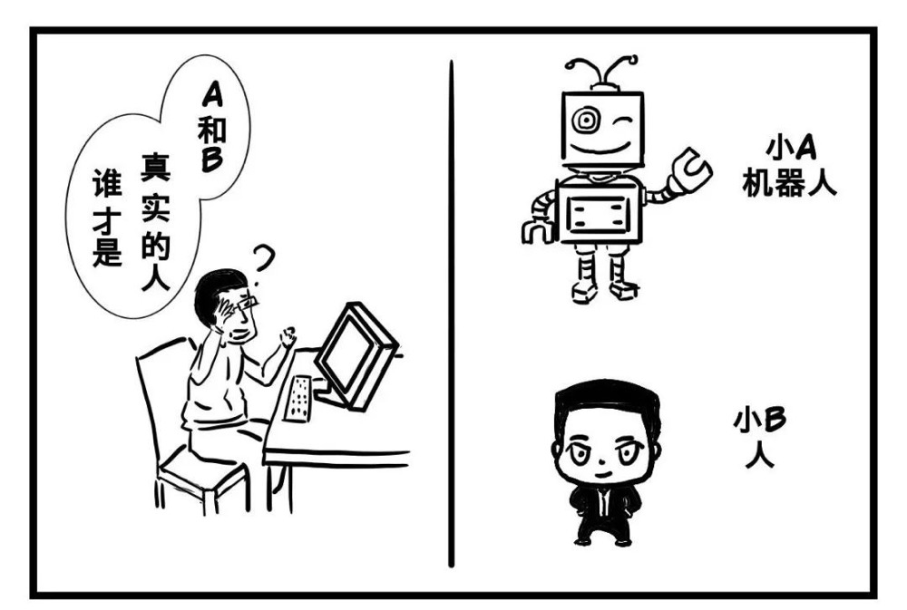
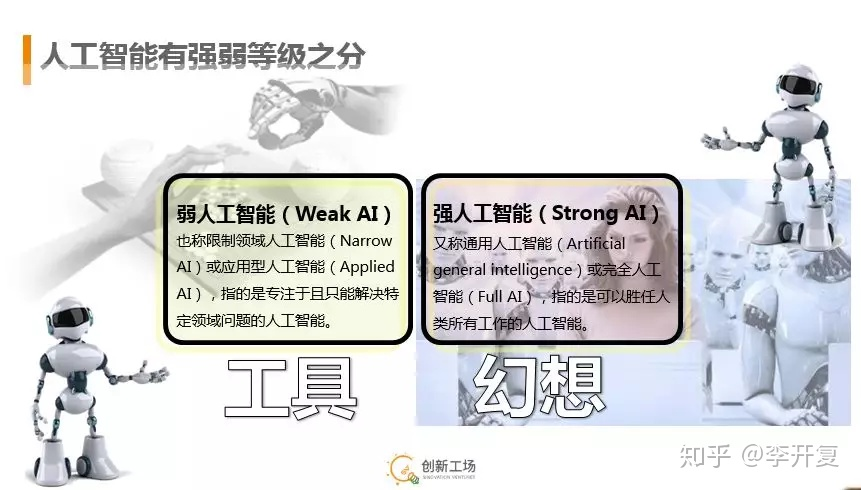
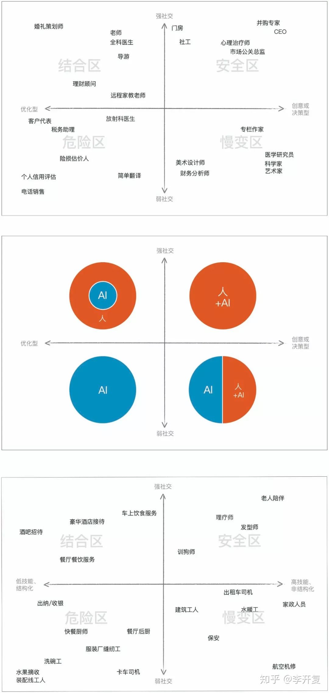
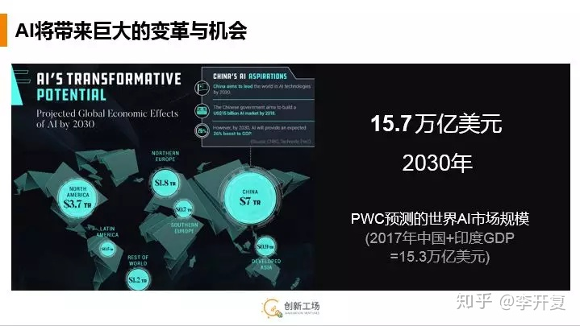

# 职位描述：

互联网有着各种各样的职位，他们各司其职，维护着整个网络的运作，更新和迭代

* 软件工程师：负责的研发主力

* 软件（后端）工程师：用接口的形式为前端提供各种后端服务

* 产品经理：负责产品的设计，链接市场侧和研发侧

* 项目经理：管理研发版本排期，对细分化的项目负责
* 技术负责人：整合前后端项目，管理研发团队
* 测试工程师：测试产品功能，确保交互产品的质量
* UI工程师：转化产品设计为直观的图像，为前端提供辅助支持

* 运维工程师：发布研发交互的产品，日常维护产品运行

* 市场运营：收集用户反馈，推销产品，整理市场需求

整个线路

老板--投资人--市场--生态--产品设计--架构设计--UI设计--项目经理--产品开发--前后端开发--系统测试--运维上线--集成维护--迭代升级

it工作者各司其职，研发序列可以深入钻研技术向更高的技术职位发展，也可以研究产品，转到产品序列
但任何一种转职都是困难的，所有的it工作者都是终身学习者，要在不同时间点对深入专研还是广博了解做出选择。
产品类工作稀少，一般一个产品搭配6到10人的研发团队，一名测试同时能处理3到4名研发的工作测试，
产品类工作更加需要工作经验作为敲门砖， 项目管理类工作则常常由技术或产品大佬兼任。

# 工作经历

自身工作经历

游戏文案策划  --》 初级软件开发工程师  --》 .net工程师 + 前端开发工程师 + node开发工程师
--》 专职前端工程师 --》 实训老师 + 前端工程师

游戏行业整体评价更加浮躁
一开始入职游戏行业，在重庆某游戏公司
面试会问很多想法，玩过什么游戏，对游戏玩法机制，营运机制的理解

问题比较主观， 比较考临场发挥
由于毕业生比较众多，所以整体比较卷，比较评面试官喜好录用

然后做了游戏的文案内策划

注意：国内游戏策划  不等于  国外游戏设计人
区别：游戏设计人拥有完全的自主性，能决定游戏怎么做，细节，玩法，甚至营销都由设计人主导
老板提供平台，并不干涉游戏设计者的发挥

国内游戏策划：分类非常细致，主策划，数值策划，文案策划，关卡策划，活动策划
及时主策划也不具有游戏设计的完全自主性
有点类似于运营驱动，老板会划定目标，策划人在完成目标的前提下，在设计玩法时就不得不考虑加入付费系统
个别老板甚至会直接干预游戏制作

平台和直播控制流量，分成蛮横，盗版横行，很长时间扼杀着国内原创游戏市场的发展

后离职转为软件工程师

一开始自学相当艰苦

渐渐熟悉.net开发和web开发

由于微软以前的策略，导致.net生态在国内比较萎缩，重庆使用的公司真的不多
但同时竞争也较少，一般和求职java 的人数达到倍差以上

生态优势上java 服务端，同时可以开发手机端，库非常多，各方面性能中规中矩

.net是java的追赶者，可以开发桌面运用，最新的.net core有着优于java的性能，但生态圈有完善

web前端慢慢成为网页端开发的核心，随着node的崛起，js 慢慢成为前端之王

# 未来浅见

* 人工智能的时代

艾伦图灵和图灵测试？
码农列传： 计算机祖师爷 艾伦图灵
人工智能之父

冯.诺伊曼 和 近代计算机工业体系

facebook首席ai科学家原话：
人工智能技术，犹如一个无比巨大的可口的樱桃蛋糕；
而现今人类所有已掌握的人工智能技术就是蛋糕上面的樱桃，樱桃下面巨大的糕体和美味的奶油我们还无从得知

* 人工智能可能如何替代人类

程序员就处于慢变区

* 今后发展

现有技术仍在很长一段时间占据生态优势，人工智能会消灭一些工作的同时带来新的工作机会